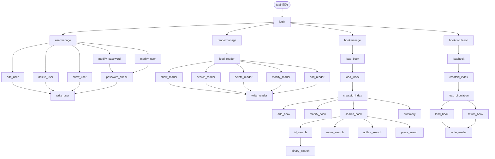
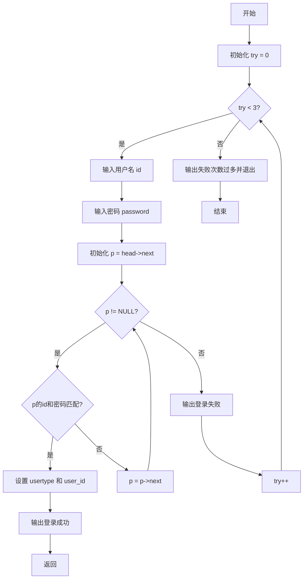
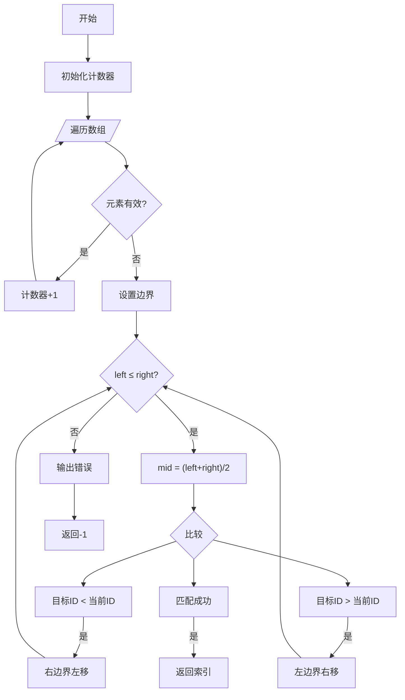

# 图书管理系统的设计与实现

---

## 一. 需求分析

### 1.1 用户类型


- 系统管理员(usertype = 1)
- 图书管理员(usertype = 2)
- 普通读者(usertype = 3)

> 基于用户类型判断功能是否开放给该用户

### 1.2 模块分析

|模块|输入数据|输出数据|处理逻辑|
|----|:-----:|:-----:|-------|
|用户登录|用户名，密码|登陆成功/失败提示|验证三次失败则退出|
|图书查询|书号/书名/作者/出版社|图书详细信息|通过索引查询|
|借书处理|读者号，书号|借书成功/失败提示|检查读者借书限额及图书藏量|

### 1.3 非法输入处理
- 用户密码需为8位字母+数字组合，否则提示重输
- 书号输入时需验证是否存在，不存在则提示错误

---

## 二. 概要设计



>注: 系统调用函数关系图

---

## 三. 详细设计

### 3.1 结构体

#### 3.1.1 用户结构
```c
typedef struct User       //用户结构
{
    int id;
    char password[20];
    int usertype;
} User;
```

#### 3.1.2 读者结构
```c
typedef struct            //读者结构
{
    int id;
    char name[20];
    char workunit[20];
    long phonenumber;
    int available;
    int borrownum;
} Reader;
```

#### 3.1.3 图书结构
```c
typedef struct book       //图书结构
{
    int recordnum;
    int id;
    char name[20];
    char author[20];
    char press[20];
    int collectionnum;
    int lendnum;
    int pointer_1;
    int pointer_2;
    int pointer_3;
} Book;
```

#### 3.1.4 书名次关键字索引结构
```c
typedef struct name_index
{
    char name[20];
    int head;
    int length;
} Name_index;
```

#### 3.1.5 作者次关键字索引结构
```c
typedef struct author_index
{
    char author[20];
    int head;
    int length;
} Author_index;
```

#### 3.1.6 出版社次关键字索引结构
```c
typedef struct press_index
{
    char press[20];
    int head;
    int length;
} Press_index;
```

#### 3.1.7 id索引结构
```c
typedef struct id_index
{
    int id;
    int recordnum;
} Id_index;
```

#### 3.1.8 图书流通索引结构
```c
typedef struct circulation
{
    int id;
    int bookid;
    char lendtime[20];
    char returntime[20];
    int state;
} Circulation;
```
---

### 3.2 部分函数流程图

#### 3.2.1 login函数流程图


#### 3.2.2 二分法函数流程图

---

## 四. 测试阶段

### 4.1 登录功能测试

|测试内容|输入|预期结果|实际结果|
|-------|----|-------|--------|
|正确登录|用户名:1998017,密码:1234567q|进入主菜单|成功|
|密码错误三次|用户名:test,密码:test|退出|成功|

### 4.2 借书功能测试

| 测试内容 | 输入 | 预期结果 | 实际结果 |
| -------- | ---- | -------- | -------- |
|超限借书|读者号:1998017(已借10本), 书号:1021|提示“借书数量已达上限”|成功|
|存书不足|书号:1021(存量0)|提示“该书已借完”|成功|

### 4.3 索引测试

- [x] 主关键字索引
- [x] 书名次关键字索引
- [x] 作者次关键字索引
- [x] 出版社次关键字索引 
---

## 五. 调试分析

> 在编写代码的过程中，我遇到了很多问题，也出现过一些bug
> 下面我举几个调试过程中遇到的困难 or bug以及它的解决方法

### 5.1 指针三兄弟
>What's 指针？

当我打开《**Linux下程序设计基础综合实验**》想要看一下有关索引的介绍时，~~我人傻le~~，看了半天也没看懂这**三个指针**是干嘛用的。

**苦思冥想**了半天(~~通义千问谢谢你~~)，终于***想***明白是怎么回事了。

原来啊，指针指向的就是**上一本**和它有**同样性质**(书名/作者/出版社相同)的书呀！
这下我就可以解决使用索引查找的问题了！！

具体呢，要先从**链头指针**找起，然后顺藤摸瓜(就像链表一样)，就可以找到所有有**同样性质**的书了。

不多废话(~~内心os:不想一句一句解释~~)，上代码(以name_search为例):

```c
void name_search(void)
{
    char name[20];
    printf("请输入要查询的图书名：");
    scanf("%s", name);
    int namenum = 0;
    for (int i = 0; name_index[i].head != '\0'; i++)
    {
        namenum++;
    }
    int bookplace = 0; // (已修改)
    for (int i = 0; i < namenum; i++)
    {
        if ((strcmp(name, name_index[i].name)) == 0)
        {
            bookplace = i;
            break;
        }
    }
    printf("----------------\n");
    printf("记录号为: %d\n", name_index[bookplace].head);
    int recordnum = name_index[bookplace].head;
    printf("图书名: %s\n", book[recordnum - 1].name);
    printf("作者: %s\n", book[recordnum - 1].author);
    printf("出版社: %s\n", book[recordnum - 1].press);
    printf("藏书量: %d\n", book[recordnum - 1].collectionnum);
    printf("借出量: %d\n", book[recordnum - 1].lendnum);


    while (recordnum != 0)
    {
        recordnum = book[recordnum - 1].pointer_1;
        if (recordnum == 0)
        {
            break;
        }
        printf("----------------\n");
        printf("记录号为: %d\n", recordnum);
        printf("图书名: %s\n", book[recordnum - 1].name);
        printf("作者: %s\n", book[recordnum - 1].author);
        printf("出版社: %s\n", book[recordnum - 1].press);
        printf("藏书量: %d\n", book[recordnum - 1].collectionnum);
        printf("借出量: %d\n", book[recordnum - 1].lendnum);
    }
}
```
呃呃

你以为到这就结束了？

***NONONO***

其实我和三兄弟的爱恨情仇才刚刚开始

---

### 5.1.1 POINTER_NOT_FOUND
>如何确定指针的值？

解决完前面的问题，我立刻转战下一个函数 **add_book**

嗯，***十分的简单***，***十分的容易***。

**嗯？！！！不对！！！**

添加书是不是也要知道后面的**三个指针**呢？
怎么知道？不知道。

emmmmmmm，于是我又想了半天

~~于是下面的代码就自动蹦出来了(bushi)~~
```c
int booknum = 0;
    int nameposition = 0;  //指针一
    int authorposition = 0;//指针二
    int pressposition = 0; //指针三

    for (int i = 0; book[i].id != '\0'; i++)
    {
        if (book[i].id == temp.id)
        {
            printf("图书号重复\n");
            return;
        }

        if (strcmp(book[i].name, temp.name) == 0)
        {
            nameposition = i + 1;
            //printf("nameposition = %d\n", nameposition);
        }

        if (strcmp(book[i].author, temp.author) == 0)
        {
            authorposition = i + 1;
            //printf("authorposition = %d\n", authorposition);
        }

        if (strcmp(book[i].press, temp.press) == 0)
        {
            pressposition = i + 1;
            //printf("pressposition = %d\n", pressposition);
        }
        booknum++;
    }
```
我还是解释一下吧

简单来说，就是如果有和这本书的**名字/作者/出版社**相同的书
那么就记录下它的位置，这样在后面添加书的时候，就可以直接使用**这个位置**来作为它的指针了。

很简单吧，我当时**就 是 想 不 到** ：>

---

### 5.1.2 关键字，你在哪？

> 如何修改文件里面特定行内的数据呢？

解决完上面的指针问题，接下来我打算完善索引的下一部分功能
假如你添加了一本新书的话，那么你不仅仅要**修改图书主系统文件**
还要分别**修改另外四个索引文件**

简而言之，要修改索引文件里面的**链头指针**和**长度**(如果与现有索引重复，否则新增索引)

也许我可以直接修改**数组**里面的内容(因为我把索引信息都保存在结构体数组中了，详见**3.1**)
然后用把**数组**里面的内容再次写到**文件**里面(就像前面把链表写入文件)

***但是！！***

我当时不知怎么想的，使用了**直接写入文件**的方式
这种方式**又 麻 烦** 又容易**出bug**

~~我感觉我当时脑袋抽了~~

具体实现方法见下码：：：<
```c
if (nameposition != 0) //书名有重复的情况
    {
        FILE *fp;
        fp = fopen("name_index.txt", "r+");  //读写模式
        if (fp == NULL)
        {
            printf("文件打开失败\n");
            exit(1);
        }
        char buffer[100];
        while (fgets(buffer, sizeof(buffer), fp) != NULL)  //逐行翻阅文件
        {
            if (strstr(buffer, temp.name) != NULL)  //strstr用于在一个字符串中查找是否有另一个字符串在里面，并返回该字符串地址
            {
                match_position = ftell(fp) - strlen(buffer);  //减去字符串长度，得到匹配位置(因为fgets跳过了)
                //printf("GOT IT\n");
                break;
            }
        }

        int length = 0; //此段用于修改长度(已修改)
        for (int i = 0; name_index[i].head != 0; i++)
        {
            if (strcmp(name_index[i].name, temp.name) == 0)
            {
                length = name_index[i].length;
                break;
            }
        }

        fseek(fp, match_position, SEEK_SET);  //将文件指针移动到匹配位置
        fprintf(fp, "%s %d %d", temp.name, booknum + 1, length + 1);  //修改长度
        fclose(fp);
    }
```
***十分的难受，十分的头疼***
~~再多看一眼就会爆炸~~

但是最后也能成功写入，只不过走了点弯路。

好在我没有全篇都使用这个方法，下文给出我的另一种解决思路

### 5.1.3 复活吧！我的文件。

> 我当时采用的 **终极** 解决方法

经过了大量的读写，我自己也~~快吐血~~
在modify_book函数里，我竟再次尝试上述写入文件方法，未果。
```c
/*
    以下都是废话，没有卵用
    sprintf(id_str, "%d", id);
    long match_position;
    while (fgets(buffer, sizeof(buffer), fp) != NULL)
    {
        if (strstr(buffer, id_str) != NULL)
        {
            match_position = ftell(fp) - strlen(buffer);
            fseek(fp, match_position, SEEK_SET);
            fprintf(fp, "%d %d %s %s %s %d %d %d %d %d", book[booknum].recordnum, book[booknum].id, book[booknum].name, book[booknum].author, book[booknum].press, book[booknum].collectionnum, book[booknum].lendnum, book[booknum].pointer_1, book[booknum].pointer_2, book[booknum].pointer_3);
            break;
        }
    }
    fclose(fp);*/
```
该方法有**大量**的bug

我只能冲个浪看看有没有别的方法

---
- [x] 正在搜集全网资料 
- [x] 正在整合资料
- [x] 头脑风暴ing~~~
- [x] 处理完成！ 
---
最后我给出的答案是：

#### 临时文件转储法

事实上，这好像就是直接覆盖文件的**间接**方式

具体实现见下码:）
```c
FILE *fp;
    fp = fopen("bookinformation.txt", "r+");
    if (fp == NULL)
    {
        printf("文件打开失败\n");
        exit(1);
    }

    char buffer[100];

    FILE *tefp; //临时文件转储法(上插入法舍弃)
    tefp = fopen("bookinformation.tmp", "w+");
    if (tefp == NULL)
    {
        printf("临时文件创建失败\n");
        exit(1);
    }
    int i = 0;
    while (fgets(buffer, sizeof(buffer), fp) != NULL)
    {
        fprintf(tefp, "%d %d %s %s %s %d %d %d %d %d\n", book[i].recordnum, book[i].id, book[i].name, book[i].author, book[i].press, book[i].collectionnum, book[i].lendnum, book[i].pointer_1, book[i].pointer_2, book[i].pointer_3);
        i++;
    }
    fclose(tefp);

    char oldname[] = "bookinformation.tmp"; //重命名
    char newname[] = "bookinformation.txt";
    rename(oldname, newname);
```
就是新建一个临时文件，把数据从数组写入临时文件
然后把临时文件重命名，覆盖掉原来的文件。

**I'M TIRED**

---

### 5.2 Segmentation Fault
> 碰到了不该碰的地方

在我的图书流通管理系统里面，有这样几行代码
```c
Node *p_1 = head_1;  //创建新节点
    while (p_1->next != NULL)
    {
        p_1 = p_1->next;
    }
```
其中，**head_1**是之前创建好的**图书流通链表的头**
这几行代码的意思就是想到**链表的末尾**，然后好方便**添加新节点**

但是它却没能按预期工作，使中间多出了几个新节点
导致当时我测试**借书功能**的时候，***一借***，***啪！***，***很快啊***，一下多出好几个重复的记录

***为什么呢？***

最初我怀疑是**条件判断**出了问题
直接把代码改成这样了
```c
Node *p_1 = head_1;  //创建新节点
    while (p_1 != NULL)
    {
        p_1 = p_1->next;
    }
```
当我***信誓旦旦***地调试到这一步时
**OOPS**
我的屏幕突然蹦出一条**红色牌匾**
上面挂着他的名字：
#### Segmentation Fault
**不好**！！有**不速之客**
~~为了改bug而出现更大的bug~~
是我，碰到了**不该碰到**的内存
~~下面都为NULL了，怎么还往下找啊？~~


于是我调试了一遍又一遍
最后发现当借书的**数据到末尾**时，指针仍**不为NULL**

看了一眼该指针指向节点的其他数据

**原来如此！！**

请看下码：）
```c
typedef struct Node       //链表结构
{
    User data;
    Reader reader_data;
    Circulation circulation_data;
    struct Node *next;
} Node;
```
嗯，是我在创建结构体时，让**多个数据共用了一个结构体**
导致也许**这个数据到末尾**时，**另一个数据**没有到末尾

哦，这样的话，改成这样 **就可以了** 吧！

```c
Node *p_1 = head_1;  //创建新节点
    while (p_1->next != NULL)
    {
        if(p_1->next->circulation_data.id == 0)
        {
            break;
        }
        p_1 = p_1->next;
    }
```
我用**图书流通管理自己的数据**来判断不就行了！

好啊，终于写完最后一个例子了，**完结撒花！**

---
## 六. 结语

稍后补充结语~~~